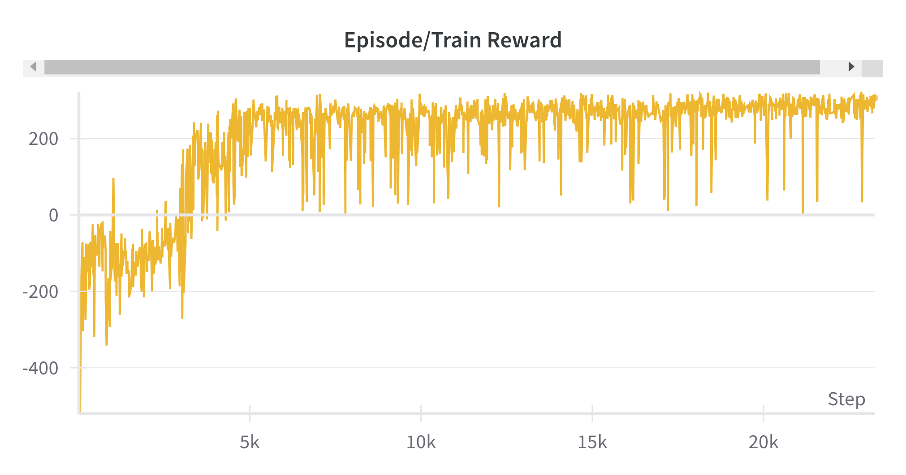
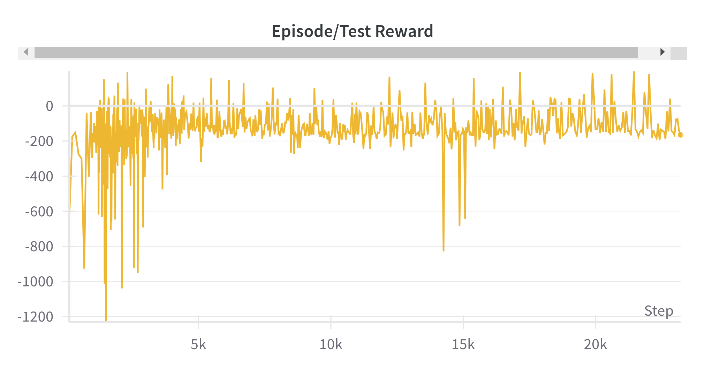
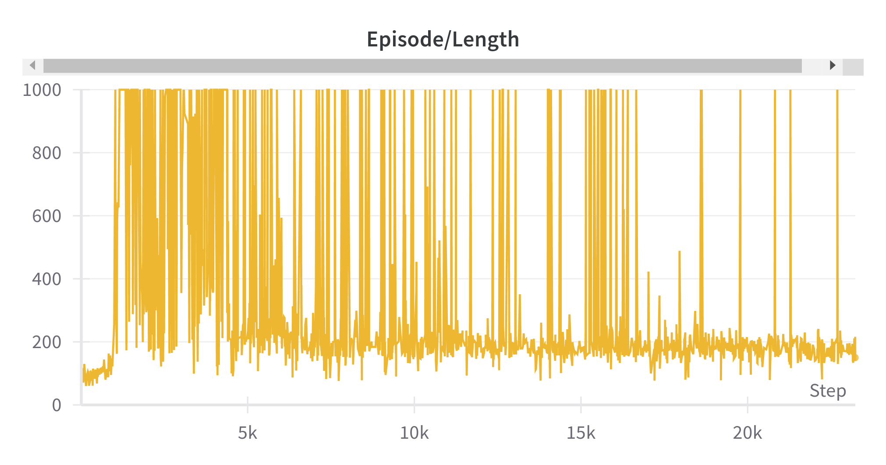
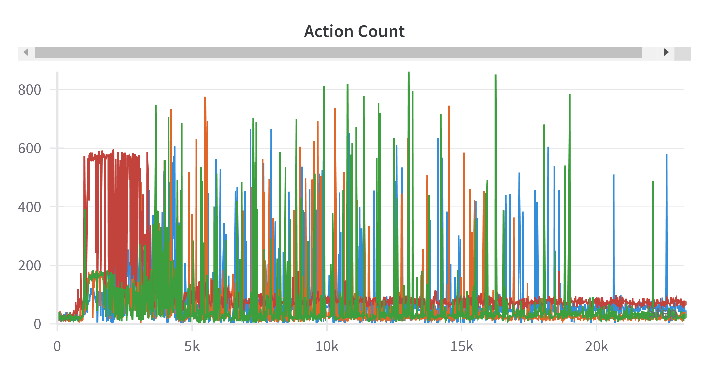
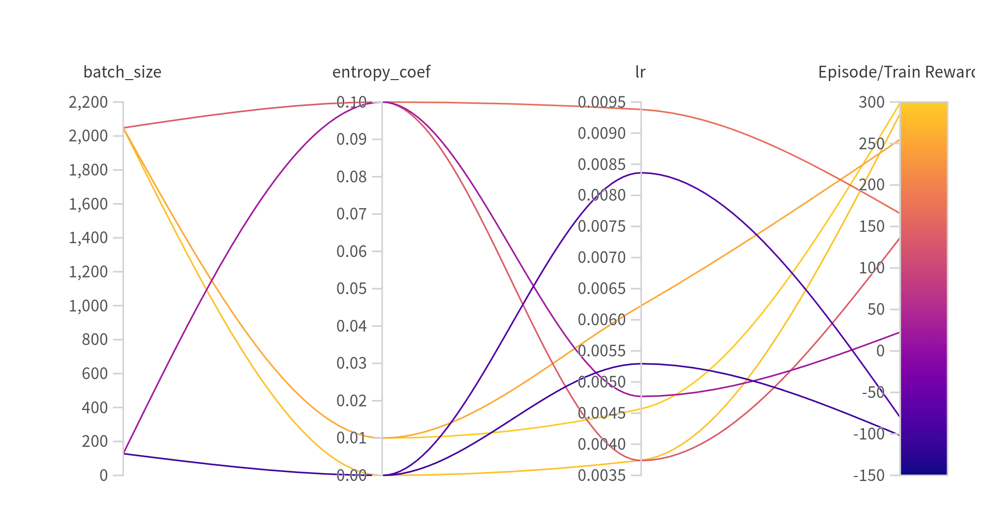
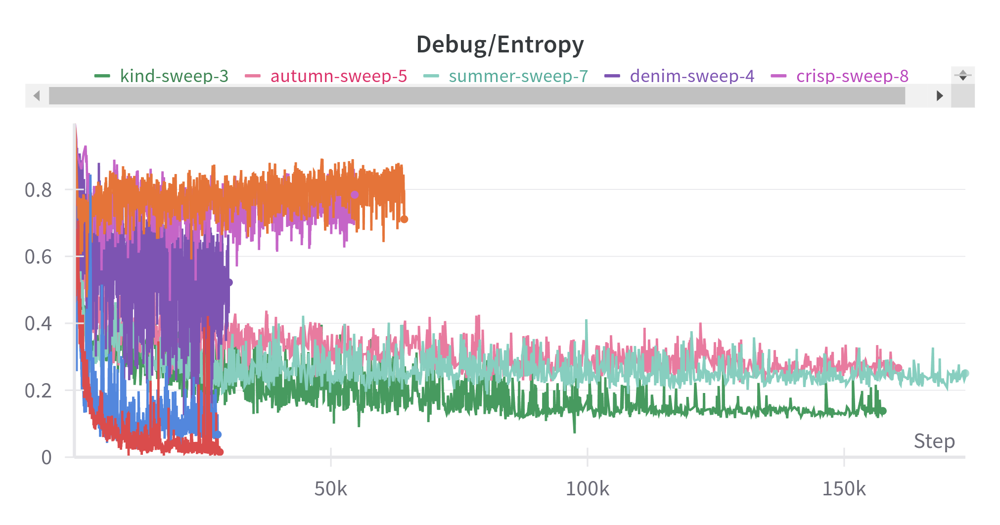
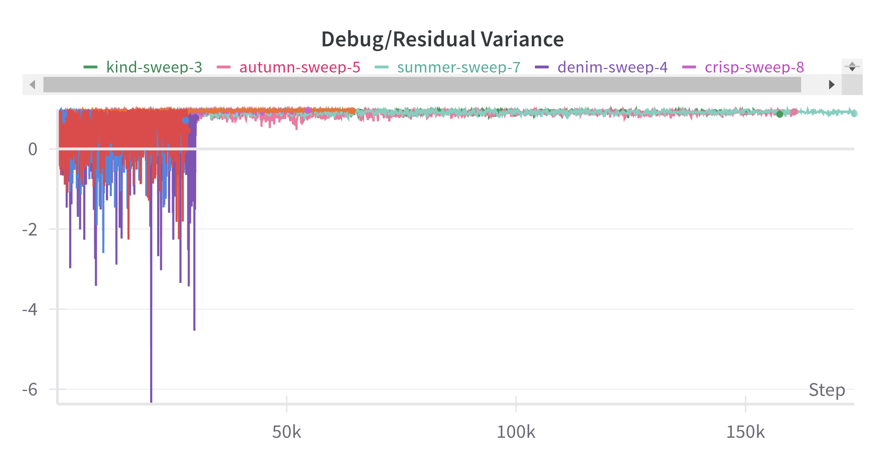

# Lunar Lander using RL (PPO actor-critic)
This is a practice project that solves the [lunar lander environment](https://gymnasium.farama.org/environments/box2d/lunar_lander/) using Procimal Policy Optimization (PPO).

# Solution progress
This is a video showcasing the agent's progress every ~5000 steps, with the last video reflecting the final agent's capabilities.
Sorry for not removing the watermark :').

<video width="720" height="480" controls>
  <source src="resources/lunar_lander_progress.mp4" type="video/mp4">
</video>

# Logging

I used WandB for logging and as you can see from the plots I have to wait around 25000 episodes until my agent became robust enough to basically solve every single episode variation (within that environment seed - see limitations).

<table>
  <tr>
    <td></td>
    <td></td>
  </tr>
  <tr>
    <td></td>
    <td></td>
  </tr>
</table>

# Important points
- Big batch size stabilized the training process (I eventually used 10240).
- Learning rate was the most important parameter to tune (I eventually chose 0.01 with linearly decaying schedule)
- I normalized and clipped both the observations and the rewards.
- I used Generalized Advantage Estimation (GAE)
- For all the other parameters, I pretty much adapted the suggested parameters from [1, 2].
- The most helpful logging metrics for debugging by far were residual variance and relative entropy as explained in [3]. 

# Sweep
I also run a sweep to compare higher and lower batch sizes and how they interact with the learning rate and the entropy coefficient. The results were inconclusive, as the sweep would take too long to finish. However, I concluded that in my case:
- The entropy coefficient size is almost completely irrelevant
- Larger batch lead to more stable learning
- A learning rate in the range of (0.01 ~ 0.001), depending on the batch size, would work

<table>
  <tr>
    <td></td>
    <td></td>
    <td></td>
  </tr>
</table>

# Limitations
The current agent was trained on a single lunar lander environment, which made it "overfit" to it and not be able to generalize when presented with environments with different random seeds and thus, starting states.
This is easily seen by the "test reward" metric here.

<tr>
<td></td>
</tr>

To avoid that and create an actually generalizable agent (at least within the lunar lander context), one should train using parallel vectorized environments as shown [here](https://gymnasium.farama.org/tutorials/gymnasium_basics/vector_envs_tutorial/). This, however, is out of the scope of this project. This should make the agent able to handle a more diverse set of states and especially, initial conditions.

# Sources
To build and debug the agent I mainly read and followed the instructions of the following 2 papers and 1 blog:
1. [IMPLEMENTATION MATTERS IN DEEP POLICY GRADIENTS: A CASE STUDY ON PPO AND TRPO](https://arxiv.org/pdf/2005.12729)
2. [What Matters In On-Policy Reinforcement Learning? A Large-Scale Empirical Study](https://arxiv.org/pdf/2006.05990)
3. [Debugging RL, Without the Agonizing Pain](https://andyljones.com/posts/rl-debugging.html)
